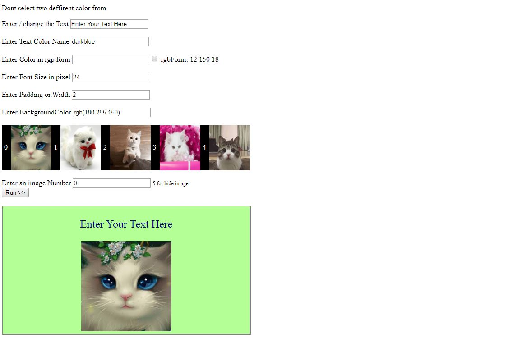

# NoCode_Tool
 User Control the width and size color adding images, padding, background-color, etc,  the good and important part is the values are unlimited! user can choose any color name or rgb value  or any text size, etc  
 This can be used for build cv templates, design website template
 
 

